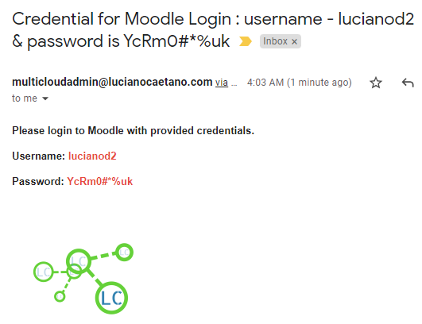

# Integration of Moodle with Sendgrid for sending e-mail with username and password random generated after registration.
## GCP - Cloud Functions, Moodle, SendGrid, and Python



## main.py
```yml
import requests
import random
import json
import os
from flask import escape
from flask_cors import CORS, cross_origin
from sendgrid import SendGridAPIClient
from sendgrid.helpers.mail import Mail, Email


@cross_origin()
def receive_request_tcbgcpfinal(request):
    request_form = request.form

    if request_form and 'inputNome' and 'inputSobrenome' and 'inputEmail' in request_form:
        nome = request_form['inputNome']
        sobrenome = request_form['inputSobrenome']
        email = request_form['inputEmail']

        resultado = cria_usuario_moodle(email,nome,sobrenome)

        if resultado == 'sucesso':
                return 'Request received successfully..'
        else:
                print('RR:ERROR:USER_CREATION_FAILED')
                return 'Error, please contact the system administrator.'
    else:
        print('RR:ERROR:PARAMETER_NOT_FOUND')
        return 'Error, please contact the system administrator.'

def cria_usuario_moodle(email,nome,sobrenome):

        token = os.environ.get('MOODLE_TOKEN')
        servidor = os.environ.get('MOODLE_SERVER')
        api_key =  os.environ.get('API_KEY')

        characters = "01234567890ABCDEFGHIJKLMNOPQRSTUVWXYZ&*(){}[]|/\?!@#$%^abcdefghijklmnopqrstuvwxyz"        
        password_length = 10        
        password = "".join(random.sample(characters, password_length))
        
        function = 'core_user_create_users'
        url = 'http://{0}/webservice/rest/server.php?wstoken={1}&wsfunction={2}&moodlewsrestformat=json'.format(servidor,token,function)

        email = email
        username = email.split("@")[0]

        users = {'users[0][username]': username,
                'users[0][email]': email,
                'users[0][lastname]': sobrenome,
                'users[0][firstname]': nome,
                'users[0][password]': password}

        try:
                response = requests.post(url,data=users)
                if 'exception' in json.loads(response.text):
                        print('Result: ' + response.text)
                        return 'erro'
                else:
                        print('Result: ' + response.text)
                        print('Result  is : ' + response.text)
                        message = Mail(from_email='multicloudadmin@lucianocaetano.com', to_emails=email, subject= 'Credential for Moodle Login :  ' + 'username - ' + username + ' & password is ' + password , plain_text_content='Welcome to Moodle Integration Challenge !!! Your username ' + username + ' and password ' + password + ' .', html_content='<p><strong> Please login to Moodle with provided credentials.</strong></p><p><strong> Username: <span style="color:#e74c3c">' + username + '</span></strong></p><p><strong> Password: <span style="color:#e74c3c">' + password + '</span></strong><p><strong></strong></p>')
                        sg = SendGridAPIClient(api_key)
                        response = sg.send(message)
                        print(response.status_code)
                        print(response.body)

                        return 'sucesso'
        except Exception as e:
                print(e)
                return 'erro'
```

## requirements.txt

```yml
# Function dependencies, for example:
# package>=version

requests==2.22.0
sendgrid==6.0.5

flask
flask-cors
pyperclip
requests
```

```
Updating in progress...

```
*Live :v:
*Love :heart:
*Learn :see_no_evil: :hear_no_evil: :speak_no_evil:

:rocket::rocket::rocket:
*GCP
*Cloud Functions
*Moodle
*Python
*pracima
*thecloudbootcamp
